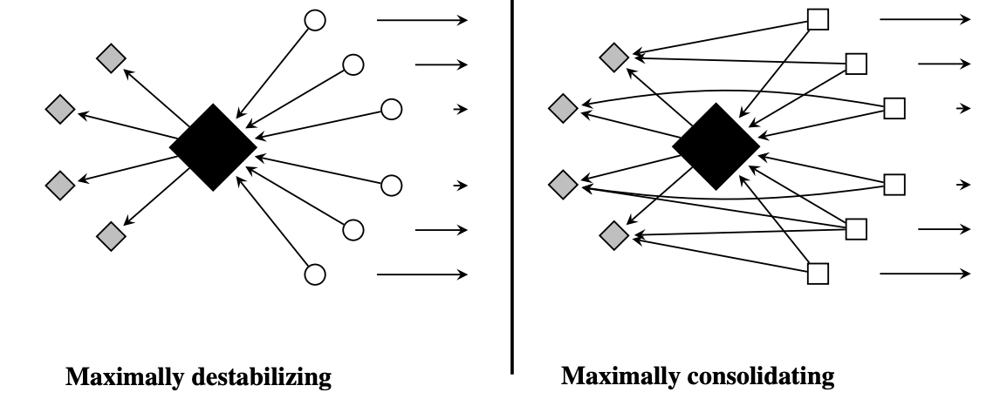

```{r setup, include=FALSE}
knitr::opts_chunk$set(echo = TRUE)
```

## Introduction

My goal is to understand constitutional decision-making using sociological theories that have traditionally been used to understand scientific practice, technological innovation, and organizational learning. In particular, I'm interested in studying creativity and innovation in an environment that *actively* *discourages* novelty.

The approach I want to take is very different to the usual "law and society" approach, which focuses on the law's entanglement with different forms of inequality (e.g., class, gender, race). These scholars tend to see the law as a reflection (or rationalization) of broader power dynamics. The difference in approach is reminiscent of the opposition between "legal formalism" and "legal realism", which deals with the thorny question of whether law can be differentiated from politics. Formalists emphasize internal dynamics, whereas realists emphasize exogenous dynamics (e.g., economics, electoral politics, public opinion, social movements)[^1].

[^1]: @tamanaha2009 argues that the distinction between "formalism" and "realism" is more a caricature than an actual description of how lawyers think about their own practice.

The emphasis on internal dynamics is increasingly common in some parts of cultural sociology [see @kaufman2004], though perhaps the most famous example of such form of explanation is Kuhn's [-@kuhn2012] account of how the accumulation of anomalous findings drives scientific revolutions. With regards to legal reasoning, the closest example I could find that puts internal dynamics in the foreground is Arthur Stinchcombe's [-@stinchcombe2001] *When formality works: Authority and Abstraction in Law and Organizations.* Stinchcombe notes that sociologists have largely focused on "formal structures" that are either (1) pathological or (2) serve ritual purposes disconnected from the substance of what organizations do. But this perspective "does not have the guts of institutions in it" [@stinchcombe1997, pp. 17]; most people inside organizations are not all that cynical and---for the most part---judges are interested in having legal cases "handled right" (i.e., in conformity with professional norms). In other words, the people who serve as "the guts of institutions" actually believe in them and actively hold organizations account to their values.

*The problem with viewing constitutional decision-making as a reflection of politics (or power) is that we then have difficulties condemning the increasing politicization of the judicial field.* If the boundary between law and politics is just a fraud---a well concocted lie---, then there's nothing extraordinary about having an increasing number of judges that make decisions on the basis of "external" interests. Sociologists of science have faced similar conundrums in the past with regards to climate change denial and the rise of conspiracy theorists [see @latour2004].

Note that the argument I'm trying to make can take a strong and a weak form.

-   *Strong version.* Focusing on power and politics leads to wrong conclusions when thinking about the evolution of constitutional decision-making.

-   *Weak version.* It's important to pay attention to the "guts of institutions" as part of a larger explanation of legal change and innovation, which also includes realist conceptions.

I align more with the weak version. It seems obvious that extra-legal interests and considerations play an important role. But the importance of these extrinsic interests is itself an empirical question that depends on the court's current membership. And by focusing only on the written texts I can highlight the type of internal dynamics that usually get ignored by social science research.

*Theoretical significance*

I expect that my project will be of interest to sociologists who use network methods to study innovation in science and technology. This literature usually studies innovation in an environment that rewards novelty, but "legal innovation" takes place in an environment that discourages novelty. Legal reasoning is constrained by *precedent*. Thus, *innovation in the judicial field must masquerade as "conservatism" or "tradition".*

Ronald Dworkin [-@dworkin1986] describes this process through a metaphor that I believe is amenable to social network analysis: the *chain novel* as an endogenous mechanism of constraint.

> *In this enterprise a group of novelists writes a novel* seriatim*; each novelist in the chain interprets the chapters he has been given in order to write a new chapter, which is then added to what the next novelist receives, and so on. Each has the job of writing his chapter so as to make the novel being constructed the best it can be, and the complexity of this task models the complexity of deciding a hard case under law as integrity.*
>
> @dworkin1986 [pp. 229]

Another important difference between legal reasoning and scientific practice is that judges are not engaged in fact-based controversies[^2]. Rather, controversies arise over the interpretation and application of different abstract *principles* and constitutional *rights* with regards to "hard cases". Legal principles are the raw materials of legal reasoning[^3].

[^2]: Fact-based controversies are usually deferred to domain experts.

[^3]: "Hard cases" are those cases in which a judge's decision is not unambiguously dictated by precedent. These cases are usually decided by appeal to broad *principles* (as opposed to narrow *rules*) that are widely applicable and that might collide with each other under certain circumstances.

An example of this kind of principle-based argumentation can be applied to the general idea that precedents should be *binding,* itself known as the "principle of *stare decisis".* This principle is itself supported by the principles of *legal certainty* and (formal) *equality*---i.e., that law should be predictable in its enforcement, and that it should apply equally to all citizens. Thus, these three principles should co-occur regularly[^4].

[^4]: The Colombian Constitutional Court makes this argument in several decisions (e.g., `SU-354-17`).

```{r, echo=FALSE, out.width="40%", fig.align='center'}
knitr::include_graphics("images/principle-triad.png")
```

The existence of these abstract principles means that judges don't have full discretion over the cases for which there's no clear precedent. They are bound to argue their decision by appealing to existing legal principles, even if they are motivated by "external" interests. The solution to a "hard case" must be found within the growing corpus of legal precedent.

At the same time, precedents are not supposed to be *too binding* because that would lead to the law's "ossification". The world changes and the law must keep track of those changes if it's to remain relevant. A rigid interpretation of precedent doesn't allow to correct past mistakes, hindering the law's ability to set itself on a "trajectory of improvement" [@stinchcombe2001]. Moreover, there's no clear framework that can unambiguously dictate whether a past decision can be considered precedent for a future case.

## **Framework/ Hypotheses**

The main empirical question this paper seeks to answer are *how does this corpus change over time* and *how are new patterns of citation introduced?*

My premise is that innovation and creativity in constitutional decision-making takes place on a regular basis, even if it looks very different to what sociologists are accustomed to.

For my purposes, I will define an *innovative legal argument* as "configuration of cultural elements" that provide "aha!" moments to judges attempting to make decisions.

In other words: *innovation = creativity + success.*

-   *Creativity.* @godart2020 [pp. 494] define creativity as "an intentional configuration of cultural and material elements that is unexpected for a given audience". Here the main audience are the judges themselves and the "cultural elements" I'm focusing on are legal precedents.

-   *Success.* I'll use the *cumulative citation count* as an index of success because it captures the extent to which other judges find a legal argument to be useful in deciding other cases.

Looking at these documents, I expect to see a few general patterns with regards to judicial innovation:

-   A decision will be innovative when judges cite a long-forgotten case and interpret it in a novel way. This is captured by Merton's [-@merton1968] concept of "adumbration" or the motivated search for old cases that allow for the hiding of novelty behind the veil of tradition.

-   Innovation will happen when a legal principle that's widely applicable in particular domain (e.g., free speech, tax policy, transitional justice) gets introduced to a different domain. This sort of transposition should happen more often when judges confront "hard cases".

    This is the familiar case of *repurposing*---i.e., "a new purpose for an old tool".

-   Innovation will happen when a *novel combination* of legal-principles is deployed as a legal argument that's useful for decision-making.

    This is the the case of "recombinant innovation" [e.g., @uzzi2013].

    For example, I should be able to show that the CCC relied on some combination of principles when discussing a particular topic in the past (e.g., "gender discrimination"), but that it now relies on some other combination of principles.

This proposal is not looking to make strong causal claims, *the goal is description*. I plan on using citation networks and text analysis to get at a large-scale phenomenon in ways that are unfeasible with close reading of texts. However, I do take a theoretical stance on *where* to look for the main sources of change and innovation in constitutional decision-making.

Some critics may argue that anything important in legal matters is "exogenous" and that it's therefore foolish to look for "endogenous" drivers of innovation. For example, changes in the co-citation network during 2020 (e.g., citations to long-forgotten cases, new combinations of principles, etc.) are surely due to COVID and not to the internal dynamics of constitutional law. Presumably this happens for every instance of "innovation" I will be able to find---e.g., a peace process, an economic recession, social unrest, etc.

I think the answer to this puzzle is recognizing that both endogenous and exogenous drivers of innovation form a sort of "duality", that they exist simultaneously but that the endogenous part cannot be reduced to a simple consequence (or reflection) of "external" dynamics.

## **The data**

I've collected over 26,000 decisions made by the Colombian Constitutional Court (CCC) for the 1992-2020 period. The documents are basically unstructured pieces of text, but they are sufficiently standardized so that it's relatively straightforward to extract some simple features---e.g., citations to past cases and mentions of legal principles.

Colombia changed its Constitution in 1991, which means that the which means that the CCC had to start almost from scratch following that year. Since then, each judicial decision made by the CCC has been assigned a standardized name (e.g., `C-776-03`, `T-025-04`, `SU-1184-01`).

Each prefix carries a particular meaning:

-   **`C`**: refers to the cases in which the CCC decides whether a law, rule, administrative decision is compatible with constitutional norms. This is also known as *judicial review.*

-   **`T`**: refers to "tutela", an individual complaint mechanism or special writ for the protection of fundamental rights. These "tutelas" can be filed with little formal requirements by any citizen before any ordinary judge and they eventually reach the CCC.

    > *The Tutela gives every person the power to go before any judge in the country to request the protection of her fundamental constitutional rights whenever threatened or violated by any public authority or private power. The first-instance judge must decide in 10 days. Judges have honored this short deadline. The appeal must be decided in 20 days, a timeline loosely respected by the second-instance judge, tribunal, or court.*
    >
    > @cepedaespinosa2019 [pp. 28]

    The CCC selects only a few (approximately 2%) for its review and the final decision may uphold or reverse decisions made by lower courts.

-   **`SU`**: refers to decisions in which the Court has decided to compile several `T` cases. They're a sort of legally binding "Annual Reviews" for the judicial system in Colombia.

Together, these decisions form a complex citation network with nearly 600,000 edges[^5].

[^5]: If I manage to also extract the name of the actual judge making the decision for each of these 26,000 cases, I could also explore the question of whether some of them act as *individual innovators.*

## Previous research

The citation network I have collected shares many formal properties with those that have been studied in the field of science an technology. Thus, it makes sense to start my analysis by figuring out if I can find similar phenomena---e.g., "obliteration by incorporation" [@merton1968; @shwed2010], "adumbrations" [@merton1968], "creative destruction" [@mcmahan2021], "disruption" [@funk2017; @wu2019], and "recombinant innovation" [@uzzi2013; @leahey2014].

Each of this ideas has an associated network imagery.

-   The idea of **"obliteration by incorporation"** is associated with a network in which most citations are to recent cases (i.e., short-range connections, like knitting).

    This idea is similar to the concept of **"black boxing"**, which refers to the process whereby previous research stops getting cited precisely because it has been elevated to "common sense" and is therefore taken for granted. In order for this to happen, previous research gets simplified and packaged in seemingly unproblematic ways---every messy detail is concealed [@latour1987]. As this process unfolds, consensus leads to no citation at all---e.g., nobody needs to cite the U.S. Surgeon General report of 1964 to support the claim that tobacco causes cancer [@shwed2010].

-   The idea of **"adumbration"** is associated with the motivated search for arguments in old cases, in deference to tradition (i.e., long-range connections, more like a small-world type network).

    @merton1968 complains about how *adumbrationists---*more common in the humanities---have a particular strong bias towards finding strong resemblances were they don't exist. But this is actually a feature of constitutional decision-making, which has an institutional deference towards precedent.

-   The concept of **"creative destruction"** in citation practices [@mcmahan2021] is associated with the idea that certain pieces of *synthetic work* (i.e., `SU` decisions) can be seen as an *intervention* on a the whole network, reducing citations to some cases but promoting others to the status of *exemplars* (or widely cited precedent)*.*

    Over time, these exemplars become "hubs" in a network that has a core-periphery structure.

-   @funk2017 developed an index that can be used to measure whether a case *destabilizes* the way precedent is being cited (i.e., a break with the past) or whether it *consolidates* it (i.e., increases the coherence of some domain).

    > *Our intuition is that citations of predecessors should decrease after a destabilizing invention is introduced because the technology entails a break with past ways of thinking. By contrast, consolidating inventions should be cited together with their predecessors and therefore increase citations of technologies on which they build.*
    >
    > @funk2017 [pp. 3]

    Like @mcmahan2021, @funk2017 are interested in measuring change at a level of granularity that's intermediate between "paradigm shifts" [cf @kuhn2012] and "black boxing" [cf @shwed2010]. Their index is aimed at capturing "degrees of consolidation and destabilization ranging from large-scale transformations to smaller-scale, incremental shifts" [@funk2017, pp. 3].

    The network image is provided by the following sketch [@funk2017, pp. 794]:

    ```{r, echo=FALSE, out.width="80%", fig.align="center"}
    
    ```

-   The basic idea of **recombinant innovation** is that "new" ideas are not usually "out there" waiting to be discovered, but that they are usually created by reconfiguring existing resources in different ways. Research on scientific practice has focused on the the novel juxtaposition of scientific ideas as a source of innovation [@foster2015; @leahey2014; @uzzi2013].

    The idea of recombinant innovation resonates with different understandings of creativity. For example, @godart2020 [pp. 494] define creativity as "an intentional configuration of cultural and material elements that is unexpected for a given audience"[^6]. For my purposes, an innovative legal argument is understood as "configuration of cultural elements" that provide "aha!" moments to judges attempting to make decisions.

    @uzzi2013 look at the references contained in each document and use statistical methods to assign a *z-score* to each pairing. If a document cites 20 previous documents, then it has ${20 \choose 2} = 190$ pairings (and z-scores). Some of these pairings may be conventional and some may be unexpected (or novel).

    This literature has taken the *cumulative citation count* as an indicator of innovation because presumably it captures "the extent to which the work was useful to---and valued by---other scholars" [@leahey2014, pp. 347]. Following this line of reasoning, research in the sociology of science typically focuses on the *tension* between "tradition" and "innovation" [e.g., @foster2015]. The idea is that there's some optimal combination of novel and conventional pairings; "novelty and conventionality are not opposing factors in the production of science; rather, papers with an injection of novelty into an otherwise exceptionally familiar mass of prior work are unusually likely to have high impact" [@uzzi2013, pp. 470][^7].

    Note that @uzzi2013 don't actually focus on pairings of articles, but on pairings of *journals.* Similarly, @leahey2014 focus on pairings of *keywords.* I think it makes more sense for this project to focus on pairings of *domains*---as defined through some form of clustering of texts (e.g., using topic models)---and pairings of *principles.*

[^6]: The main difference between "creativity" and "legal innovation" is that later is associated with a more cumulative process that signals some form of improvement in how things are done. This distinction is taken from @godart2020.

[^7]: This focus on optimality is similar to how some researchers think about the *tradeoff* between "exploitation" and "exploration" in the organizational learning literature [@march1991]. I'm still unsure about how to adapt these ideas to constitutional decision-making because the CCC is not embedded in a competitive setting. Rather, it's embedded in a "strong institutional environment" in which an organization will typically get rewarded when it conforms to certain rules and requirements [@scott1991].

Finally, it's worth noting two relevant concepts that, unlike the previous ones, are not usually associated with network imagery.

-   ***Professional work***

    @abbott1988 uses the expression "professional work" to describe how professionals use their expert knowledge to deal with particular problems, as part of a broader competition to lay claim over particular sets of tasks. Thus, professional knowledge is "successful" to the extent that it can classify a problem (*diagnostic*), reason about it (*inference*), and/or take action on it (*treatment*).

    The relevant dimension here is classification. Judges take a problem and filter out all kinds of "irrelevant" information in order to form an image that can later be embedded in a classification system. More importantly, this classification system tends to be highly complex; if it wasn't, there would be no need to involve the experts.

    What's particular to constitutional decision-making is that it functions as a "moving classification system", it has the potential of changing with every new decision.

-   ***Organizational memory***

    I'm thinking about the CCC as an organization that "learns". However, a lot of the literature on organizational learning doesn't seem particularly relevant. It usually focuses on organizations that learn by monitoring some sort of "performance" metric (or target) in a competitive setting. But the CCC has no such thing as a "target", and it isn't embedded in a competitive setting either

    The part of the literature that focuses on *organizational memory* [@levitt1988, pp. 319]*,* however, seems highly relevant: how do organizations encode, store, and retrieve the lessons of history despite personnel turnover and the passage of time? The answer to these questions should shed light on the co-citation networks I'm planning to look at. For example, I'm fairly certain that one of the biggest contributors to change in this citation network is the creation of the same digital search engine I used to scrape all of these documents.

    The CCC is more akin to an organization that's trying to preserve its "organizational memory" and less akin to the decentralized network of research universities that make up the bulk of scientific publications. In this sense, the erasure of past decisions (decisions that are forgotten) is more the result of the cognitive and organizational difficulties of trying to remember every possible decision ever made. This is why one ofmy strongest claims is that "innovation" in constitutional decision-making is related to the novel interpretation of long-forgotten precedents.

    An important aspect of this citation network---which we can consider a network *of* culture---is that a lot of it goes unused, similarly to how @martin2010 describes "culture" as a junkyard. An alternative metaphor to Dworkin's *chain novel* might very well come from the old reality TV show *Junkyard Wars*, in which every week a team of engineers must assemble a working machine out of the materials available in a junkyard. Similarly, judges---*and their clerks*---assemble arguments from available precedents. I believe this is the process that drives---to borrow even more metaphors---the birth, life-expectancy, death, and even "resurrection" of precedents.

## References
