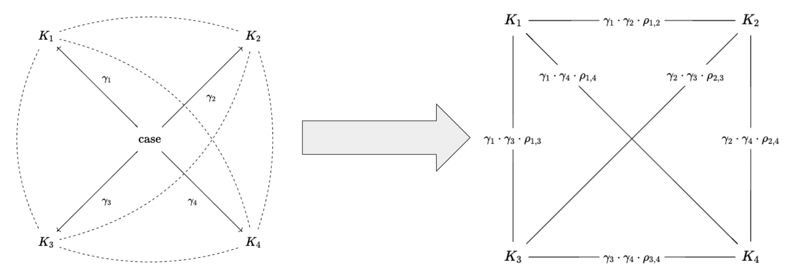

```{r setup, include=FALSE}
knitr::opts_chunk$set(
  echo = FALSE, 
  fig.align = "center", 
  dev = "png", 
  dpi = 400,
  warning = FALSE,
  message = FALSE,
  cache = TRUE,
  out.width = "100%"
)

library(tidyverse)

theme_custom <- function() {
    theme_light(base_family = "Amiri") + theme(
    plot.title = element_text(face = "bold"),
    strip.text = element_text(colour = "white"), 
    strip.background = element_rect(fill = "#4C4C4C")
  )
}

theme_set(
  theme_light(base_family = "Amiri") + theme(
    plot.title = element_text(face = "bold"),
    strip.text = element_text(colour = "white"), 
    strip.background = element_rect(fill = "#4C4C4C")
  )
)

# options(tinytex.verbose = TRUE)

## TO DO:
## MAKE PRINCIPLES BETTER (SYNONYMS + REGEX FOR BOUNDED WORDS) [check]
## MAKE TOPICS BETTER
## Make use of fixed degree sequence model instead of stochastic one

## Make outdegree have a separate effect per spline, or try APC

## re-do analysis with only largest component
## look at moody and mcfarlane for regression tips

```

```{css, echo=FALSE}
blockquote {
  font-size: 14px;
  color: #828282;
}

body {
  font-family: Crimson Text, Palatino, serif;
  font-size: 16px;
  text-align: justify;
  
  width: 90%;
  margin: auto;
}

.todolist {
  padding: 1em 1em 1em 0em;
  margin-bottom: 10px;
  border: 2px solid orange;
  border-radius: 10px;
  background: #f5f5f5 5px center/3em no-repeat;
}
```

```{r}
source("second-year-paper-data-plots.R")
```

```{r, eval=FALSE}
source("viz_cemetary.R")
```

## Introduction

::: {#intro-notes .todolist}
-   This section will need to be reformatted for the final paper -- e.g., with longer paragraphs, more citations for your assertions, and less informality.

-   Be more specific about methods.

-   Tie the "principle" and "domain" arguments as instances of what @pachucki2010 call "cultural holes" or "patterned absences of relationships".
:::

This paper attempts to understand creativity and innovation in an environment that actively *discourages* novelty: constitutional decision-making in higher courts. More specifically, I use a variety of methods to look at the network of citations embedded in all decisions made by the Colombian Constitutional Court (CCC) for the `r paste(range(metadata$year), collapse = "-")` period.

Sociologists typically use network methods to study innovation in science and technology. But this literature usually studies innovation in an environment that rewards novelty. Legal reasoning, on the other hand, is constrained by *precedent*. Judges must show deference to decisions and styles of reasoning made in the past. In other words, *innovation in the judicial field must masquerade as "conservatism" or "tradition".*

Thus, this part of a larger call for researchers to "pay further attention to explaining, or at least accounting for, variance in cultural fields with respect to their institutionalized tolerance for (and tendency to promote or discourage) cultural innovation and change" [@kaufman2004, pp. 352]

*I define an innovative legal argument as any configuration of cultural elements that's useful for judges attempting to solve hard cases*[^1]*.* My claim is that innovative legal arguments are mediated by three internal mechanisms:

[^1]: This follows from the way in which @godart2020 [pp. 494] define creativity as "an intentional configuration of cultural and material elements that is unexpected for a given audience". See @dworkin1975 on the notion of "hard cases".

-   Adumbration---or the motivated search for long-forgotten cases which can then be reinterpreted in novel ways. This allows for judges to hide their creative work behind the veil of tradition.
-   Principle recombination---or the novel combination of legal principles used in the construction of arguments.
-   Topic transposition---or taking a legal argument that's widely applicable in a particular domain (e.g., tax policy) and then introducing it into a different domain (e.g., healthcare). This is the familiar case of *repurposing*---i.e., "a new purpose for an old tool".

The approach I take is very different to the usual "law and society" approach [@calavita2016], which prioritizes the law's entanglement with different forms of inequality (e.g., class, gender, race). These scholars tend to see the law as a reflection (or rationalization) of broader power dynamics. The difference in approach is reminiscent of the opposition between "legal formalism" and "legal realism", which deals with the thorny question of whether law can be differentiated from politics. Formalists emphasize internal dynamics, whereas realists emphasize exogenous dynamics (e.g., electoral politics, public opinion, economics, social movements)[^2].

[^2]: @tamanaha2009 argues that the distinction between "formalism" and "realism" is more a caricature than an actual description of how lawyers think about their own practice.

The emphasis on internal dynamics is increasingly common in some parts of cultural sociology [see @kaufman2004], though perhaps the most famous example of such form of explanation is Kuhn's [-@kuhn2012] account of how the accumulation of anomalous findings drives scientific revolutions. With regards to legal reasoning, Arthur Stinchcombe [-@stinchcombe2001] has noted that when sociologists study "formal structures"[^3] in organizations they either focus on the fact that (1) they seem inconsequential or (2) that they serve some pathological purpose. But this perspective "does not have the guts of institutions in it" [@stinchcombe1997, pp. 17]; most people inside organizations are not all that cynical and---for the most part---judges are interested in having legal cases "handled right" (i.e., in conformity with professional standards and norms). In other words, the people who serve as "the guts of institutions" hold organizations accountable to their values[^4].

[^3]: In this literature, the "formal structures" employed by organizations are usually (1) regulations, rules, and procedures; (2) expert knowledge and techniques; or (3) classification systems and categories.

[^4]: *The problem with viewing constitutional decision-making as a reflection of politics (or power) is that we then have difficulties condemning the increasing politicization of the judicial field.* If the boundary between law and politics is just a fraud---a well concocted lie---, then there's nothing extraordinary about having an increasing number of judges that make decisions on the basis of "external" interests. Sociologists of science have faced similar conundrums in the past with regards to climate change denial and the rise of conspiracy theorists [see @latour2004].

The argument I'm making is that---beyond the focus on power and politics---it's important to pay attention to the "guts of institutions" as part of a larger explanation of legal change and innovation, which also includes realist conceptions. It seems obvious that extra-legal interests and considerations play an important role. But the importance of these extrinsic interests is itself an empirical question. So, by focusing only on the written texts, I'm highlighting the type of internal dynamics that usually get ignored by social science research.

Finally, I only examine the effects of constitutional decision-making on the CCC's own citation practices---i.e., the way in which past decisions affect future decisions. In other words, my key dependent variable is each decision's *cumulative citation count*. To the extent that creative legal arguments are deemed adequate and useful in solving hard cases, they will continue to be cited in future decisions. I will not examine the multiple effects that these decisions can have on the "outside world."[^5]

[^5]: See @rodríguez2015 for an account of how a single decision can have very real effects, such as the direct alteration of state policy, opportunities for coalition building among social activists, or framing effects with regards to public opinion.

## Theory

::: {#theory .todolist}
-   Draw attention to the extensive work that sociologists have done on innovation and citation networks. Then make the argument that the evolution of law (and legal precedent) is different from what we've seen in domains such as academic citation, patent networks, interpersonal citation (e.g., studies of status), etc.

-   Martin: I like the description of mechanisms here, but they are a bit brief and too short to stand as sections on their own. It might be useful for you to illustrate the operation of each mechanism through a hypothetical citation network graph.

    *Add a hypothetical citation graph for each of these three examples?*
:::

### Innovation in Science and Technology

Legal citation networks share many formal properties with those that have been used to study innovation in science and technology [e.g., @uzzi2013; @funk2017; @wu2019]. In all cases we have a directed network of either scientific articles or technological patents that are citing each other over time. The main difference is that, as mentioned earlier, this type of creative work takes place within environments that encourage novelty.

Also, the CCC is more akin to an organization that's trying to preserve its "organizational memory" and less to the decentralized network of researchers and/or entrepreneurs that make up the bulk of citation networks in science or technology.

Regardless of these differences, many of the concepts I'm using to think about these issues originated in this literature. There are at least three network metaphors that arise from this literature:

*A network of citations filled with short-range connections (i.e., like knitting).*

This type of network might be generated through "knowledge encapsulation" [see @merton1968 on "obliteration by incorporation"; @whitley1970 on "black boxing"]. This is a process whereby previous research stops getting cited, but only because it has been elevated to "common sense"---i.e., it's taken for granted.

For this to happen, previous research gets simplified and packaged in seemingly unproblematic ways---every messy detail is concealed [@latour1987]. As this process unfolds, consensus leads to lack of citations after a certain time---e.g., nobody needs to cite the U.S. Surgeon General report of 1964 *anymore* to support the claim that tobacco causes cancer [@shwed2010].

*A network of citations filled with long-range connections (i.e., a small-world type of network).*

This type of network might be generated through what @merton1968 calls "adumbration" or deference to *tradition.* @merton1968 complains about how *adumbrationists---*more common in the humanities---have a particular strong bias towards finding strong resemblances where they don't exist. But this is actually a feature of constitutional decision-making, which has an institutional deference towards precedent.

Similarly, @hargens2000 notes that a disprortionate citation of "old" foundational documents occurs when authors cite papers as examples of *perspectives* or *general approaches* rather than as support for specific points---e.g., citing Karl Marx to make the general point that exploitation matters.

*A network of citations that's subjected to episodic moments of disruption and consolidation.*

This type of network arises through the mechanism of "creative disruption" [@mcmahan2021; @funk2017]. The idea is that some pieces of creative work can be seen as an *intervention* on the whole network. In the case of constitutional decision-making, some decisions might reduce citations to a set of previous cases but promote others to the status of widely cited precedents (or exemplars).

@funk2017 developed an index that can be used to measure whether a new node *disrupts* the way other nodes are being cited (i.e., a break with the past) or whether it *consolidates* them (i.e., increases the coherence of some domain). The intuition is that a disruptive node will decrease the citations of predecessors because this new node (e.g., a technology, an idea, a decision) indicates a break with past ways of thinking; in contrast, a consolidating node should be cited together with their predecessors.

@funk2017 are interested in measuring change at a level of granularity that's intermediate between "paradigm shifts" and "knowledge encapsulation". Their index is aimed at capturing "degrees of consolidation and destabilization ranging from large-scale transformations to smaller-scale, incremental shifts" [@funk2017, pp. 793]. Unfortunately, their proposed index assumes that a new node is *either* disruptive *or* consolidating to a certain degree. They don't consider the possibility that a new node exhibits *both* effects for different subsets of future nodes [@funk2017, pp. 813]. The fact of the matter is that the potential "disruptiveness" of a decision is subject to interpretation. The Figure attached in the appendix shows the disruption index proposed by @funk2017 for the decisions in this dataset and shows that these decisions are almost never quite disruptive, but they're not very consolidating either.

Finally, a subset of this literature focuses on the concept of *recombinant innovation.* The argument is that "new" ideas are not usually "out there" waiting to be discovered, but that they are usually created by reconfiguring existing resources in different ways. Research on scientific practice has focused on the the novel juxtaposition of scientific ideas as a source of innovation [@leahey2014; @uzzi2013]. Following this line of reasoning, research in the sociology of science typically focuses on the *tension* between "tradition" and "innovation" [e.g., @foster2015]. The idea is that there's some optimal combination of novel and conventional pairings; "novelty and conventionality are not opposing factors in the production of science; rather, papers with an injection of novelty into an otherwise exceptionally familiar mass of prior work are unusually likely to have high impact" [@uzzi2013, pp. 470].

### Hard cases and innovation

Legal scholarship is filled with disparate accounts of legal reasoning and innovation. In short, legal scholars disagree on the amount of discretion judges have when deciding on *hard cases.* Hard cases are those cases in which a judge's decision is not unambiguously dictated by precedent and which are then usually decided by appeal to broad *principles*---as opposed to narrow *rules* [@dworkin1975]. This situation is often referred to by other theorists with notion that legal language has an "open texture" and that ambiguity in certain cases can never be eliminated, thus judges end up exercising some degree of discretion [@hart2012].

In short, some theorists emphasize the degree of arbitrariness, discretion, and manipulability involved in the process [e.g., @kennedy1991; @levi2013], whereas others emphasize coherency, predictability, and constraint [e.g., @dworkin1986]. This difference in emphasis loosely maps into the opposition between "legal formalism" and "legal realism". However, no serious scholar denies that legal arguments contain aspects of both; "legal reasoning has a logic of its own" [@levi2013, pp. 104]. The important takeaway from controversy is that hard cases force judges to innovate, and that *legal principles* (or standards) play a key role in this.

Ronald Dworkin [-@dworkin1986] describes this process through a metaphor that I believe is amenable to social network analysis: the *chain novel* as an endogenous mechanism of constraint.

> "In this enterprise a group of novelists writes a novel *seriatim*; each novelist in the chain interprets the chapters he has been given in order to write a new chapter, which is then added to what the next novelist receives, and so on. Each has the job of writing his chapter so as to make the novel being constructed the best it can be, and the complexity of this task models the complexity of deciding a hard case under law as integrity".
>
> @dworkin1986 [pp. 229]

An example of the kind of principle-based argumentation described by Dworkin can be applied to the general idea that precedents should be *binding,* or that precedents have a sort of "gravitational force". This is itself known as the "principle of *stare decisis".* The argument rests on two other principles: *legal certainty* (law should be predictable in its enforcement) and *fairness* (treating like cases alike).

Thus, these three principles should co-occur regularly:

Figure \@ref(fig:triad-p)

```{r triad-p, out.width="40%", fig.cap="Description"}
knitr::include_graphics("images/principle-triad.png")
```

The Colombian Constitutional Court makes this argument explicit in several decisions. Note that in Colombian jurisprudence the notion of "fairness" is denoted by the notion of (formal) "equality" which creates some ambiguity when judges use the same word to refer to *substantive* equality.

Note that precedents are not supposed to be *too binding* because that would lead to the law's "ossification". The world changes and the law must keep track of those changes if it's to remain relevant. A rigid interpretation of precedent doesn't allow to correct past mistakes, hindering the law's ability to set itself on a "trajectory of improvement" [@stinchcombe2001]. Moreover, there's no clear framework that can unambiguously dictate whether a past decision can be considered precedent for a future case.

However, the existence of these abstract principles does mean that judges do not have full discretion over the cases for which there is no clear precedent. They are bound to argue their decision by appealing to existing legal principles, even if they are motivated by "external" interests. In other words, the solution to a "hard case" must be found within the growing corpus of legal precedent.

## Data

I collected a corpus of over `r scales::comma(nrow(metadata))` decisions made by the Colombian Constitutional Court (CCC) during the 1992-2021 period. The documents are unstructured pieces of text, but they are sufficiently standardized so that it's relatively straightforward to extract citations to past cases.

Colombia changed its Constitution in 1991, which means that the CCC had to start almost from scratch following that year. Since then, each judicial decision made by the CCC has been assigned a standardized name (e.g., `C-776-03`, `T-025-04`, `SU-1184-01`).

Each prefix carries a particular meaning:

-   **C**: refers to the cases in which the CCC decides whether a law, rule, administrative decision is compatible with constitutional norms. This is also known as *judicial review.*

-   **T**: refers to "tutela", which is an individual complaint mechanism or special writ for the protection of fundamental rights. These "tutelas" can be filed with little formal requirements by any citizen before any ordinary judge and they may eventually reach the CCC.

    > "The Tutela gives every person the power to go before any judge in the country to request the protection of her fundamental constitutional rights whenever threatened or violated by any public authority or private power. The first-instance judge must decide in 10 days. Judges have honored this short deadline. The appeal must be decided in 20 days, a timeline loosely respected by the second-instance judge, tribunal, or court."
    >
    > @cepedaespinosa2019 [pp. 28]

    Each year, the CCC selects approximately 2% of these cases for review, and the final decision may uphold or reverse decisions made by lower courts. A lot of these cases are related to healthcare.

-   **SU**: refers to decisions in which the Court has decided to compile several `T` cases. They're a sort of legally binding "Annual Reviews" for the judicial system in Colombia.

Together, these decisions form a complex citation network with nearly `r scales::comma(nrow(el))` edges.

Note that the data only takes into consideration one single aspect of the "inside" of constitutional decision-making, ignoring links to different domestic laws, international legal standards, or the constitution itself. This doesn't mean that "real world facts" don't matter, it just means that they must be fitted into a pre-existing legal framework first. Judges regularly take problems and filter out all kinds of "irrelevant" information in order to form an image that can later be embedded in a classification system. What's particular to constitutional decision-making is that it functions as a "moving classification system", it has the potential of changing with every new decision.

***Descriptive statistics***

The following graph shows the number of cases in this dataset, broken down by year and type.

```{r, fig.height=3, fig.width=7}
figure1 + theme_custom() ## number of cases
```

This shows that the CCC is very prolific, averaging around 898 decisions per year---in comparison, the SCOTUS issues between 100 and 150 decisions per year.

Note that there seems to be an inverse relation between the number of `T` and `SU` cases, which makes sense because the whole purpose of `SU` cases is to consolidate the arguments established by `T` cases and thus the judges might prioritize ones over the others at different times. This makes sense given that 67% of the citations coming *out from* `SU` decisions target past `T` decisions and that 84% of the citations coming *into* `SU` decisions come from `T` decisions.

The following graph shows the average number of inward citations (in-degree) and outward-citations (out-degree) broken out by year and type. Note that the decisions written during 1992 tend to be significantly more cited that the ones written in other years, giving them some sort of first-movers advantage over the others. After all, the most innovative thing of any kind is the first of its kind.

```{r}
figure2 + theme_custom() ## in- and out-citations by type
```

Also note that even though `SU` decisions make a very small part of this network, they receive a large number of citations.

Finally, note that `r scales::percent(mean(metadata$indegree == 0), accuracy = 0.01)` of the decisions have never been cited. The following graph shows that there's a steady percentage of cases that never get used, except for the cases written in 2020 and 2021---those haven't had the time to be incorporated

```{r}
figure3 + theme_custom() # junkyard 
```

Thus, an important aspect of this citation network---which we can consider a network *of* culture---is that a lot of it goes unused, similarly to how @martin2010 describes "culture" as a junkyard. An alternative metaphor to Dworkin's *chain novel* might very well come from the old reality TV show *Junkyard Wars*, in which every week a team of engineers must assemble a working machine out of the materials available in a junkyard. Similarly, judges---*and their clerks*---assemble arguments from available precedents.

## Methods

::: {#methods .todolist}
-   Martin: Good to be specific here. However, by this point the reader should have a clear sense of what you are planning to model and why. The theory section should be used to motivate your outcome variable, so that the reader understands that the paper will be analyzing the impact of these legal decisions in terms of citation counts.
:::

In order to understand how the three mechanisms described above fit the data I have, I compare a variety of regression models to a baseline model that takes into account time, type (`C`, `SU`, `T`) and outdegree.

*What are the implications of inclusion of these mechanisms for future citations?*

The model is a standard negative binomial regression used for modeling count data that's over-dispersed [@gelman2020, pp. 266-8]. This baseline model follows the following specifications:

$$
\begin{align}
\text{indegree}_i &\sim \text{NegBin}(\lambda_i, \phi) \\
\log(\lambda_i) &= \alpha_0  + \underbrace{\alpha_1 \text{SU}_i + \alpha_2 \text{T}_i}_\text{indicator variables} + 
\beta_1 \text{outdegree}_i + 
\underbrace{\Sigma_{k = 1}^{8} w_k B_{k, i}}_{\text{Date B-Splines}} + 
\underbrace{\beta_2 \log(\text{age}_i)}_{\text{Offset}}
\end{align}
$$

**List of models:**

|         |                                                                        |
|:-------:|:-----------------------------------------------------------------------|
| Model 1 | Baseline Model                                                         |
| Model 2 | Baseline + Adumbration                                                 |
| Model 3 | Baseline + Topic Transposition                                         |
| Model 4 | Baseline + Principle Recombination                                     |
| Model 5 | Baseline + Adumbration + Topic Transposition                           |
| Model 6 | Baseline + Adumbration + Principle Recombination                       |
| Model 7 | Baseline + Topic Transposition + Principle Recombination               |
| Model 8 | Baseline + Adumbration + Topic Transposition + Principle Recombination |

The idea is to select the best fitting models I use leave-one-out cross-validation (LOO-CV), a standard metric for comparing the relative out-of-sample predictive performance of Bayesian models [@gelman2020, pp. 172-8; @mcelreath2020, pp. 217]. Before doing this, the next three sections describe how I came up with different measurements to track my three hypothesized mechanisms.

### Adumbration

In order to measure adumbration [@merton1968], I looked at each separate decision and then looked at the time that had passed since each reference had been cited by other cases. The following graph looks at three different cases and shows the number of days since each of these references was cited. The proposed measurement of adumbration simply takes the value of the oldest reference. For example, a case like `C-1052-01`, gets assigned the value of 1,310 which is the number of days that has passed since case `C-143-93` has been referenced by other cases.

```{r}
figure4 + theme_custom() ## adumbration in three cases
```

This is probably not the best way forward to measure this. So far,

### Principle recombination

The goal here is to figure out whether each individual case is deploying legal principles in a manner that can be considered novel or not. Unlike typical text-networks, these principles are "layered with meaning" and multiple legal treatises have been written about how to best interpret them.

In order to measure principle recombination, I first extracted a list of $238$ principles and looked for them in each case. I then constructed a $26,917 \times 238$ matrix $\mathbf{M}$ in which each row represents a separate case, each column represents a separate principle, and each cell is either $0$ or $1$ (indicating the presence or absence of a legal principle). I then used a two-mode projection $\mathbf{M^\top M}$ in order build a weighted $238 \times 238$ adjacency matrix in which each cell represents the number of decisions that mention a given pair of principles.

```{r}
# dim(pp_mat)
# pp_mat["C-776-03", ][which(pp_mat["C-776-03", ] != 0)]
```

Note that there are ${238 \choose 2} = 28,203$ possible pairings of principles (or edges between principles) and some of these pairings can be considered either typical or atypical. I use the stochastic degree sequence model---a method suggested by @neal2014 for extracting sparse signed graphs from two-mode projections---to extract typical and atypical ties. This model to compares each individual pairing's number of co-occurrences to the distribution of co-occurrences expected from a random two-mode projection in which the both the row sums and column sums of the original matrix $\mathbf{M}$ are approximately fixed (i.e., a null model). When the resulting $p$-values are very low the pairing is deemed atypical and when they are high the pairing is deemed typical. The actual ties are extracted using a statistical hypothesis test with $\alpha = 0.0001$[^6]. The result is a "backbone" or a $238 \times 238$ whose cells contain 1's and -1's for edges whose weights are respectively larger and smaller than expected in the null model.

[^6]: This approach is similar in nature to the one followed by @uzzi2013 for finding typical and atypical combinations of journal pairings.

The following graph shows the resulting network that contains positive ties between different legal principles based on their number of co-occurrences. The nodes are colored based on a popular "community detection" algorithm [@blondel2008] used to detect groups of principles that are commonly employed together.

```{r}
figure5 + theme_custom() ## full p-to-p network
```

The principles signaled out on the left---"principio de corresponsabilidad" and "principio *pro infans*" are typically used to decide matters that deal with family and children. The principles signaled on the right are about "religious pluralism" and the "secular state" which tend to co-occur precisely because they often collide with each other. The principles signaled out in the middle deal with issues regarding Colombia's *tutela* mechanism.

Intuitively, typical pairings tend to occur *within* clusters, whereas atypical pairings tend to occur *between* clusters. This is demonstrated by looking at the principles associated with decision `C-370-06` in the following graph[^7]. The panel in the left draws typical ties between principles (mostly withing clusters), whereas the panel on the left draws atypical ties between principles (mostly between clusters).

[^7]: In this particular case, the CCC took the *Justice and Peace* under judicial review. This law dealt with the demobilization of right-wing paramilitary groups. The CCC ordered a significant number of modifications to this law, forcing these groups to (1) make reparations for various victims and (2) participate in a series of "truth commissions". Note that the principles that form atypical connections in these case mention "equality", "human dignity", and "solidarity" which didn't regularly co-occur with the other principles that deal with legislative affairs.

```{r}
figure6 + theme_custom() ## case recombination
```

My measurement of "principle recombination" for this particular case simply sums these different ties and records them in two variables, one for the number of typical ties (30) and one for the number of atypical ties (35). I do this for every single case in the network.

### Topic transposition

The goal here is to figure out whether each individual case deals with topics that usually go together or not. I want to test the idea that innovation will happen when a legal argument that's widely applicable in a particular domain (e.g., tax policy) gets introduced into a different domain (e.g., healthcare). For example, has Edward Levi observed that the "present-day minimum wage and hour legislation owes its existence in some measure to diseased cattle, drunkards, defrauders, prostitutes, auto thieves, kidnappers, and convicts, and those who sought to control them [@levi2013, pp. 63].

I used *topic modeling* (also known as Latent Dirichlet Allocation) which is a popular method used to extract a series of latent topics from large amounts of unstructured text. As @blei2012 [pp. 78] explains, "the intuition behind LDA is that documents exhibit multiple topics" and each topic can be approximated as a distribution over a fixed set of words. The objective is to reduce massive amounts of unstructured texts---following a "bag-of-words" assumption---to a set of $K$ topics, which we then interpret by looking at that most prevalent words associated with each topic. Presumably, cases that deal with cattle, drunkards, prostitutes, and thieves can said to belong in different topics.

The strength behind this approach is that it's able to handle *polysemy* or the idea that a single word may have multiple meanings (e.g., "equality"), and it's able to handle *heteroglossia* or the idea that a single decision may address multiple topics at the same time. The weakness of this approach is that there's no straightforward way of identifying the "correct" number of topics and that some of the topics end up having no substantive meaning whatsoever. The common adage according to which "all models are wrong but some are useful" can be restated as "all models are very very wrong when working with text-as-data". However, it's possible to use topic models as a satisfactory strategy to measure what a text is "about".

The appendix (will) contain a thorough description of how I pre-processed this corpus [@denny2018]. The number of topics is set provisionally at 108, following the results search algorithm proposed by @mimno2014 and implemented in the `stm` package in R [@roberts2019].

Having $K =$ `r nrow(stm_corr)` means that the number of pairwise correlations amounts to `r scales::comma(choose(nrow(stm_corr),2))`, which are presented in the following histogram.

```{r}
# output <- full_join(ego_el, stm_el) |> 
#   mutate(score = weight*corr) |> 
#   filter(score < quantile(score, probs = 0.001) | score > quantile(score, probs = 0.999)) |> 
#   summarize(
#     familiar = mean(score[score > 0]),
#     unfamiliar = mean(score[score < 0])
#   )
```

```{r}
figure7 + theme_custom() ## pairwise topic correlations distribution
```

As expected, some topics are much more related than others. For example, topic 74 deals with *tutelas* through which a citizen is trying to get subsidized access to a specific treatment or medication through the healthcare system; topic 48 deals with a similar issue, but focuses on patients with HIV; and topic 39 deals with patients getting access to specific procedures (e.g., surgery).

```{r}
figure8 + theme_custom()  ## topic correlations
```

```{r, eval=FALSE}
## most correlated
# stm::plot.STM(corr_out, topics = c(48, 74, 39), type = "labels", text.cex = 3/4)
# stm::plot.STM(corr_out, topics = c(6, 98), type = "labels", text.cex = 3/4)
# stm::plot.STM(corr_out, topics = c(23, 79), type = "labels", text.cex = 3/4)
# stm::plot.STM(corr_out, topics = c(64, 94), type = "labels", text.cex = 3/4)
# 
# stm::plot.STM(corr_out, topics = c(10, 82, 90), type = "labels", text.cex = 3/4)
# 
# 
# ## less correlated
# stm::plot.STM(corr_out, topics = c(10, 19), type = "labels", text.cex = 3/4)
```

In order to measure *topic transposition* at the case level I take advantage of the fact that (1) every decision has *some* probability of belonging to every topic and (2) every pair of topics is correlated to *some* degree. Thus, I can use a strategy reminiscent of the two-mode projection used previously to create a sort of network in which each topic is connected to every other topic through each case's membership probabilities. The following figure is a schematic of how this process work for a single case with $K = 4$. The $\gamma$'s are membership probabilities and the dotted lines represent $\rho$'s or topic correlations. The resulting network has positive or negative ties (depending on the value of $\rho$).

```{r}

```

The following graph shows the results of implementing this idea for decision `T-859-03`. The panel on the left depicts familiar ties between topics (i.e., positively correlated) whereas the panel on the left depicts unfamiliar ties between topics (i.e., negatively correlated). For the sake of visual presentation, I removed pairings topics whose score ($\gamma_i \cdot \gamma_j \cdot \rho_{i,j}$) fall between the 0.001 and the 0.999 percentiles.

```{r}
figure9 + theme_custom() ## specific case example

# stm::plot.STM(corr_out, topics = c(74, 33, 48, 39, 30), type = "labels", text.cex = 3/4)
```

As mentioned earlier, topics 74, 48, and 39, deal with access to healthcare and patients with HIV. But topic 74 usually doesn't get discussed alongside topic 33, which deals with clarifying the interpretation and applicability of certain pieces of legislation.

My measurement of "principle recombination" for this particular case sums the absolute values of all these ties and records them in two variables (including the ones not shown), one for familiar ties between topics and the other for unfamiliar ties between topics. I do this for every single case in the network.

## Results

::: {#results .todolist}
-   Provide some additional discussion of key findings.

-   Improve the fit of this model by improving the baseline regression. Perhaps look at what the age-period-cohort effect people do. At least make it a hierarchical model (I just looked at outdegree by type and it's clear that `SU` types have a higher outdegree, so that shouldn't be a standalone coefficient at the very least.
:::

*Model comparison*

According to the LOO-CV metric, model 8 (including all predictors) performs best overall. Here, `elpd` stands for expected log predictive density which acts as a measure of model fit based on adding together the log scores---i.e., the logarithm of the probability or density of the observed data, given predictors included in the model [@gelman2020, pp. 174-178]. In short, higher values of `elpd` means that the model fits the data better. The column labeled `elpd_diff` compares the difference in `elpd`'s relative to the best performing model (the model with the highest `elpd`).

```{r}
loo::loo_compare(loo_out) |> 
  as_tibble(rownames = "Model") |> 
  select(Model, elpd_diff, se_diff) |> 
  mutate(across(c(elpd_diff, se_diff), round, digits = 2)) |> 
  knitr::kable()
```

Two things are noteworthy here. First, this approach generates standard errors for the differences in `elpd`'s, allowing us to be cautious when comparing different models instead of simply declaring a model to be "the winner" based on a simple score. Here, model 8 is over two standard errors away from model 7. Second, adding the measurement of *principle recombination* as a predictor produces the greatest amount of improvement.

This means one of two things: either principle recombination is the better predictor or the *measurement* of principle recombination is of better quality than the other two.

```{r}
# attr(loo_out[[8]], "formula")
```

*Interpretation*

The following plot shows the coefficients associated with each predictor, along with their 99% "credible intervals". All variables have been standardized to have a mean of zero and a standard deviation of 1, such that the estimates are comparable to each other. Finally, the coefficients have been transformed such that they can be interpreted as percentage differences in the cumulative citation counts that we expect to see when each predictor increases by 1 standard deviation. For example, for every additional 26 references made by a case, we expect to see a 39% increase in future citations.

```{r}
mod8_coeffplot + theme_custom()
```

Besides outdegree, the largest coefficient is associated with the number of atypical principle pairings included in a case, followed closely by the number of typical principle pairings. This suggests that principle-based arguments really do predict a higher number of citations. Smaller effects can be seen for my measurements of adumbration and topic transposition. Notably, cases that bridge unfamiliar topics receive higher citations but, all else equal, cases that deal only with familiar topics receive slightly less citations.

*Posterior predictive checking*

The previous results don't rule out the possibility that the models are all badly misspecified. I use *graphical posterior predictive checking* [@gelman2020; @mcelreath2020] to understand where the model is fitting the data poorly. The idea is to generate data from the fitted model and compare it to the observed data. Any systematic discrepancy between the generated data (colored in light blue) and the observed data indicates potential failings of the model.

```{r}
mod8_ppc_plots + theme_custom()
```

In short, the model underestimates the number of cases that have received between 1 and 20 citations, overestimates the number of zeroes, and overestimates the number of between 20 and 150 (left panel); it overestimates the average in-degree.

I interpret these results to mean that I should work on improving the baseline model as well.

## Discussion

-   No discussion yet.

-   Future direction from here is to exemplify how principle recombination work over time. For example, I should be able to show that the CCC relied on some combination of principles when discussing a particular topic in the past (e.g., "gender discrimination", "healthcare"), but that it now relies on some other combination of principles.

-   Note that I'm not making strong causal claims, *the goal is description*. I plan on using citation networks and text analysis to get at a large-scale phenomenon in ways that are unfeasible with close reading of texts. However, I do take a theoretical stance on *where* to look for the main sources of change and innovation in constitutional decision-making[^8].

[^8]: Some critics may argue that anything important in legal matters is "exogenous" and that it's therefore foolish to look for "endogenous" drivers of innovation. For example, changes in the co-citation network during 2020 are surely due to the global pandemic and not to the internal dynamics of constitutional law. Presumably this happens for every instance of "innovation" I will be able to find---e.g., a peace process, an economic recession, social unrest, etc. <br><br> I think the answer to this puzzle is recognizing that both endogenous and exogenous drivers of innovation form a sort of "duality". Hard cases (and *all* cases) come directly from the "outside" world. But decisions cannot be reduced to a simple consequence (or reflection) of "external" dynamics.

## Appendix

### Data

The raw data is available publicly in the following github repository:

<https://github.com/acastroaraujo/ccc_datos>

### @funk2017

```{r}
appendix1 + theme_custom() ## cd index
```

The $CD_t$ index ranges from -1 (most consolidating) to +1 (most disruptive). The CCC's decisions overall seem to fall below 0, which means that they're predominantly consolidating. But they're only a little bit consolidating, not much.

### More descriptive stuff

This table shows the within and between citations among decisions in the CCC. The references of `C` are mostly other `C` decisions (87%), and their citations come mostly from `C` decisions as well (72%). A similar pattern follows for `T` decisions. Thus, the vast amount of citations are *within* types. But the table also shows that `SU` decisions play a sort of bridging role; most citations for these decisions are *between* types (note the relative sparsity of the cell {2, 2}). The references of `SU` decisions largely come from `T` decisions (67%) and the citations largely come `T` decisions (84%), but there's also a lot of references to `C` decisions (21%).

+---------------+---------------+---------------+---------------+
| Source/Target | `C`           | `SU`          | `T`           |
+:=============:+:=============:+:=============:+:=============:+
| **`C`**       | 128,552       | 1,855         | 17,627        |
|               |               |               |               |
|               | (row: 87%)    | (row: 1%)     | (row: 12%)    |
|               |               |               |               |
|               | (column: 72%) | (column: 6%)  | (column: 4%)  |
+---------------+---------------+---------------+---------------+
| **`SU`**      | 5,485         | 3,062         | 17,049        |
|               |               |               |               |
|               | (row: 21%)    | (row: 12%)    | (row: 67%)    |
|               |               |               |               |
|               | (column: 3%)  | (column: 10%) | (column: 4%)  |
+---------------+---------------+---------------+---------------+
| **`T`**       | 44,299        | 26,730        | 370,574       |
|               |               |               |               |
|               | (row: 10%)    | (row: 6%)     | (row: 84%)    |
|               |               |               |               |
|               | (column: 25%) | (column: 84%) | (column: 91%) |
+---------------+---------------+---------------+---------------+

```{r, eval=FALSE}
tt <- table(str_extract(el$from, "."), str_extract(el$to, "."))
tt
round(prop.table(tt, 1), 2)
round(prop.table(tt, 2), 2)
```

### Pre-processing of text

To do:

-   Explain why pre-processing is important [@denny2018].
-   Describe everything I did. This has been an iterated process, with each topic modeling giving me better insight into how to remove certain words (like personal pronouns).

## References
