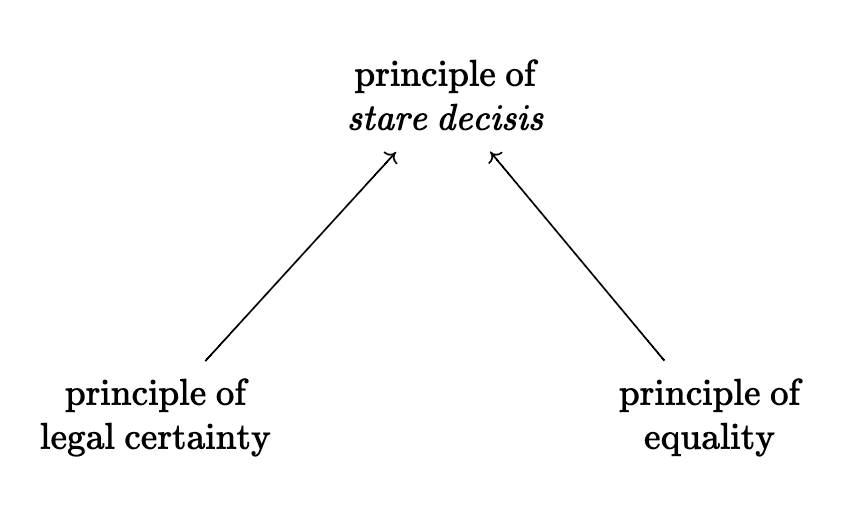
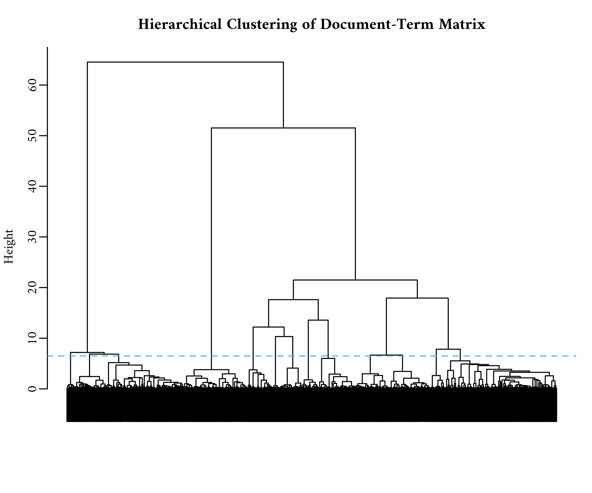

```{r setup, include=FALSE}

# To do: mention “scientific controversies” in legal arguments, particularly when talking about principle-based argumentation?
# Introduction:  longer paragraphs, more citations for your assertions, and less informality.

knitr::opts_chunk$set(
  echo = FALSE, 
  fig.align = "center", 
  dev = "png", 
  dpi = 400,
  warning = FALSE,
  message = FALSE,
  cache = TRUE,
  out.width = "100%"
)

library(tidyverse)
library(cowplot)

theme_custom <- function() {
    theme_light(base_family = "Amiri") + theme(
    plot.title = element_text(face = "bold"),
    strip.text = element_text(colour = "white"), 
    strip.background = element_rect(fill = "#4C4C4C")
  )
}

theme_set(
  theme_light(base_family = "Amiri") + theme(
    plot.title = element_text(face = "bold"),
    strip.text = element_text(colour = "white"), 
    strip.background = element_rect(fill = "#4C4C4C")
  )
)

# options(tinytex.verbose = TRUE)
```

```{css, echo=FALSE}
blockquote {
  font-size: 14px;
  color: #828282;
}

body {
  font-family: Crimson Text, Palatino, serif;
  font-size: 16px;
  text-align: justify;
  
  width: 90%;
  margin: auto;
}

.todolist {
  padding: 1em 1em 1em 0em;
  margin-bottom: 10px;
  border: 2px solid orange;
  border-radius: 10px;
  background: #f5f5f5 5px center/3em no-repeat;
}

.caption {
  font-family: Crimson Text, Palatino, serif;
  font-size: 14px;
  text-align: justify;
  margin: auto;
  padding-bottom: 12px;

}
```

```{r}
source("second-year-paper-data-plots.R")
```

```{r, eval=FALSE}
source("viz_cemetary.R")
```

::: {#.todolist}
-   Read the stuff by Diego Medina.

-   Read the stuff by Stinchcombe again.

-   Follow Martin's more substantive suggestions.

From Nico:

-   Creo que la parte de realism/formalism queda un poco flotando al principio - podría ser mas claro en que forma ese debate reta lo que estas haciendo o por que es relevante.

-   La conclusion que hay evidencia de que el balance de typical y atypical conlleva a mas citas requiere que haya artículos que usen ambas. Si existen? O sea, la afirmacion pierde validez si hay artículos que solo usan unos estilos de citación - mostly typical // mostly atypical.

    This means that I'll have to expand on the descriptive stuff. Maybe signal out some super precedents. What makes them "super"? Do the results help inform this?
:::

## Introduction

This article attempts to understand creativity and innovation in an environment that actively *discourages* novelty: constitutional decision-making in higher courts. More specifically, I use insights from the study of citation networks in science and technology to analyze the network of citations embedded in all decisions made by the Colombian Constitutional Court (CCC) for the `r paste(range(metadata$year), collapse = "-")` period.

The literature that relies on network methods to study innovation in science and technology usually understands innovation in environments that reward novelty. Legal reasoning, on the other hand, is constrained by the "gravitational force of precedent". Judges must show deference to decisions and styles of reasoning made in the past. In other words, *innovation in the judicial field---if such a thing exists---must masquerade as "conservatism" or "tradition".* Thus, this article responds to a larger call for researchers to "pay further attention to explaining, or at least accounting for, variance in cultural fields with respect to their institutionalized tolerance for (and tendency to promote or discourage) cultural innovation and change" [@kaufman2004, pp. 352]

*I define an innovative legal argument as any configuration of cultural elements that's useful for judges attempting to solve hard cases.* This definition follows from the way in which @godart2020 [pp. 494] define *creativity* as "an intentional configuration of cultural and material elements that is unexpected for a given audience". But innovation is more than just "creativity". An innovation also needs to be successful in solving a perceived problem for some audience. Thus, my definition of innovative legal arguments also follows from the observation that "innovation" is forced upon judges when they are dealing with "hard cases"---i.e., "those cases in which the result is not clearly dictated by statute or precedent" [@dworkin1975, pp. 1057].

This article explores two particular hypotheses. First, an innovative legal argument will contain some form of "principle-based argumentation"---i.e., innovative legal arguments rely on the novel combination of legal principles ($H_1$). Second, an innovative legal argument will contain traces of what @merton1968 calls "adumbration"---i.e., the motivated search for long-forgotten cases which can then be reinterpreted in novel ways, allowing for judges to hide their creative work behind the veil of tradition.

The approach I take is very different to the usual "law and society" approach [@calavita2016], which prioritizes the law's entanglement with different forms of inequality (e.g., class, gender, race). These scholars tend to see the law as a reflection (or rationalization) of broader power dynamics. The difference in approach is reminiscent of the opposition between "legal formalism" and "legal realism", which deals with the thorny question of whether law can be differentiated from politics. Formalists emphasize internal dynamics, whereas realists emphasize exogenous dynamics (e.g., electoral politics, public opinion, economics, social movements). This article prioritizes internal dynamics but does not engage in the more difficult question of adjudicating between "formalism" and "realism"---an opposition which @tamanaha2009 argues to be more a caricature than an actual description of how lawyers think about their own practice.

The emphasis on internal dynamics is increasingly common in some parts of cultural sociology [see @kaufman2004], though perhaps the most famous example of such form of explanation is Kuhn's [-@kuhn2012] account of how the accumulation of anomalous findings drives scientific revolutions. With regards to legal reasoning, Arthur Stinchcombe [-@stinchcombe2001] has noted that when sociologists study "formal structures"---e.g., legal reasoning---they either focus on the fact that (1) they seem inconsequential or (2) that they serve some pathological purpose. But this perspective---more common in research that emphasizes external dynamics---"does not have the guts of institutions in it" [@stinchcombe1997, pp. 17]; most people inside organizations are not all that cynical and---for the most part---judges are interested in having legal cases "handled right" (i.e., in conformity with professional standards and norms). In other words, the people who serve as "the guts of institutions" hold organizations accountable to their values[^1].

[^1]: *The problem with viewing constitutional decision-making as a reflection of politics (or power) is that we then have difficulties condemning the increasing politicization of the judicial field.* If the boundary between law and politics is just a fraud---a well concocted lie---then there's nothing extraordinary about having an increasing number of judges that make decisions on the basis of "external" interests. Sociologists of science have faced similar conundrums in the past with regards to climate change denial and the rise of conspiracy theories [see @latour2004].

The argument I'm trying to make is that---beyond the focus on power and politics---it is important to pay attention to the "guts of institutions" as part of a larger explanation of legal change and innovation, which also includes "realist" conceptions of how the law operates. It seems obvious that extra-legal interests and considerations play an important role. But the importance of these extrinsic interests is itself an empirical question. So, by focusing only on the written texts, I'm highlighting the type of internal dynamics that usually get ignored by social science research.

## Theory

### Citation networks in science and technology

Legal citation networks share many formal properties with those that scholars use to study innovation in science and technology [e.g., @uzzi2013; @funk2017; @wu2019]. These are usually directed networks in which scientific articles or technological patents contain citations to each other over time. The main difference is that, as mentioned earlier, these scholars study creative works in environments that encourage novelty. A second difference worth noting is that the CCC is more akin to an organization that is trying to preserve its "organizational memory" and less to the decentralized network of researchers and/or entrepreneurs that make up the bulk of citation networks in science or technology. Regardless of these differences, this literature contains concepts and metaphors that provide general insights about the evolution of citation networks.

There are at least three network metaphors that arise from this literature:

One metaphor is *a network of citations filled with short-range connections (i.e., like knitting).* This type of network might be generated through "knowledge encapsulation" [see @merton1968 on "obliteration by incorporation"; @whitley1970 on "black boxing"]. This is a process whereby previous research stops getting cited, but only because it has been elevated to common sense---i.e., it is taken for granted. For this to happen, previous research gets simplified and packaged in seemingly unproblematic ways---every messy detail is concealed [@latour1987]. As this process unfolds, consensus leads to lack of citations after a certain time---e.g., nobody needs to cite the U.S. Surgeon General report of 1964 *anymore* to support the claim that tobacco causes cancer [@shwed2010].

Another metaphor involves *a network of citations filled with long-range connections (i.e., a small-world type of network).* This type of network might be generated through what @merton1968 calls "adumbration" or deference to *tradition.* For example, @hargens2000 notes that a disproportionate citation of old foundational documents occurs when authors cite papers as examples of *perspectives* or *general approaches* rather than as support for specific points---e.g., citing Karl Marx to make the general point that exploitation matters. @merton1968 complained that *adumbrationists* have a particular bias towards finding strong resemblances where they *do not exist*. But this might actually be a feature of innovation in constitutional decision-making (see $H_2$), given its institutional deference towards precedent.

A third metaphor is *a network of citations that is subjected to episodic moments of disruption and consolidation.* This type of network arises through the mechanism of "creative disruption" [@mcmahan2021; @funk2017]. The idea is that some pieces of creative work can be seen as *intervening* on the whole network, drawing attention away from some nodes and promoting others to the status of exemplars. @funk2017 developed an index that can be used to measure whether a new node *disrupts* the way other nodes are being cited (i.e., a break with the past) or whether it *consolidates* them (i.e., increases the coherence of some domain). The intuition is that a disruptive node will decrease the citations of predecessors because this new node (e.g., a technology, an idea, a decision) indicates a break with past ways of thinking; in contrast, a consolidating node should be cited together with its predecessors.

Some of the literature invoking these metaphors emphasizes the concept of *recombinant
innovation.* The argument is that "new" ideas are not usually "out there" waiting to be discovered, but that they are usually created by reconfiguring existing resources in different ways. Research on scientific practice has focused on the novel juxtaposition of scientific ideas as a source of innovation [e.g., @leahey2014; @uzzi2013]. This literature has taken the *cumulative citation count* as an indicator of innovation because presumably it captures "the extent to which the work was useful to---and valued by---other scholars" [@leahey2014, pp. 347]. Following this line of reasoning, research in the sociology of science typically focuses on the *tension* between "tradition" and "innovation" [e.g., @foster2015]. Thus, for the purposes of innovation, there should be some optimal mixture of novel and conventional elements; "novelty and conventionality are not opposing factors in the production of science; rather, papers with an injection of novelty into an otherwise exceptionally familiar mass of prior work are unusually likely to have high impact" [@uzzi2013, pp. 470].

### Hard cases and innovation

Legal scholarship is muddled with disparate accounts of legal reasoning. Notably, legal scholars disagree on the varying amounts of discretion or constraint that judges encounter when deciding *hard cases.* Hard cases are "those cases in which the result is not clearly dictated by statute or precedent" [@dworkin1975, pp. 1057]. Other scholars believe that judges should only exercise discretion when cases fall within the "fringe of vagueness" (or "area of open texture") of existing norms [@hart2012]. In short, some theorists emphasize the degree of arbitrariness, discretion, and manipulability involved in the process [e.g., @kennedy1991; @levi2013], whereas others emphasize coherency, predictability, and constraint [e.g., @dworkin1986]. This difference in emphasis *loosely* maps into the opposition between "legal formalism" and "legal realism". However, none of these scholars deny that legal arguments contain aspects of both.

Ronald Dworkin [-@dworkin1986] describes the process of legal reasoning with a metaphor that I believe is amenable to network analysis: the *chain novel* as an endogenous mechanism of constraint.

> "In this enterprise a group of novelists writes a novel *seriatim*; each novelist in the chain interprets the chapters he has been given in order to write a new chapter, which is then added to what the next novelist receives, and so on. Each has the job of writing his chapter so as to make the novel being constructed the best it can be, and the complexity of this task models the complexity of deciding a hard case under law as integrity".
>
> @dworkin1986 [pp. 229]

Central to Dworkin's account of deciding hard cases is the idea of principle-based argumentation. In short, judges decide hard cases by appealing to broad *principles* (as opposed to narrow *rules).* An example of this kind of principle-based argumentation described by Dworkin can be applied to the general idea that precedents should be *binding,* or that precedents have a sort of "gravitational force". This is itself known as the "principle of *stare decisis".* The argument rests on two other principles: *legal certainty* (law should be predictable in its enforcement) and *fairness* (treating like cases alike). Thus, these three principles should co-occur regularly (see Figure \@ref(fig:triad-p)).

```{r triad-p, out.width="60%", fig.cap = "Co-occurrence of principles in support of precedent's \"gravitational force\". Note that in Colombian jurisprudence the notion of \"fairness\" is denoted by the word \"equality\" which creates some ambiguity when judges use the same word in different contexts to refer to \"substantive\" or \"formal\" equality."}

```

The CCC makes this argument explicit in several decisions, but notes that precedents are not supposed to be *too binding* because that would lead to the law's "ossification". In other words, the world changes and the law must keep track of those changes if it is to remain relevant. A rigid interpretation of precedent does not allow judges to correct past mistakes, hindering the law's ability to set itself on a "trajectory of improvement" [@stinchcombe2001]. Moreover, there is no clear framework that can unambiguously dictate whether a past decision can be considered precedent for a future case---i.e., the criteria for deciding that two cases are in fact alike is somewhat ambiguous.

However, the existence of these abstract principles means that judges do not have full discretion over the cases for which there is no clear precedent. They are bound to argue their decision by appealing to existing legal principles, even if they are motivated by external interests. In other words, the solution to a "hard case" must be found within the growing corpus of legal precedent.

This article is a first attempt to integrate insights from both legal theory and research on citation networks in science and technology. In particular, I'm attempting to combine the literature on "hard cases" and legal reasoning with the literature on "recombinant innovation." Following this line of reasoning, I'll also use the cumulative citation count as an index of innovation because it presumably captures the extent to which judges find a legal argument to be useful in deciding future cases.

## Data

I collected a corpus of over `r scales::comma(nrow(metadata))` decisions made by the Colombian Constitutional Court (CCC) during the `r paste(range(metadata$year), collapse = "-")` period. The documents are unstructured pieces of text, but they are sufficiently standardized so that it is relatively straightforward to extract citations to past cases.[^2]

[^2]: The raw data is available in a public repository: <https://github.com/acastroaraujo/ccc_datos>

Colombia changed its Constitution in 1991, which means that the CCC had to start almost from scratch following that year. Since then, each judicial decision made by the CCC has been assigned a standardized name (e.g., `C-776-03`, `T-025-04`, `SU-1184-01`).

Each prefix carries a particular meaning: "C" refers to the cases in which the CCC decides whether a law, rule, administrative decision is compatible with constitutional norms---also known as *judicial review. "*T" refers to *tutela*, which is an individual complaint mechanism or special writ for the protection of fundamental rights. These tutelas give people the power to to before any ordinary judge and request the protection of their "fundamental constitutional rights" whenever they are perceived to be threatened [@cepedaespinosa2019, pp. 28]. Each year, the CCC selects approximately 2% of these cases for review, and the final decision may uphold or reverse decisions made by lower courts. A lot of these cases are related to healthcare. Finally, "SU" refers to decisions in which the Court has decided to compile several `T` cases. They're a sort of legally binding "Annual Reviews" for the judicial system in Colombia. Together, these decisions form a complex citation network with nearly `r scales::comma(nrow(el))` ties among them.

Figure \@ref(fig:num-cases) shows the number of cases in this dataset, broken down by year and type. The CCC is very prolific, averaging around 898 decisions per year; in comparison, the Supreme Court of the United States issues between 100 and 150 decisions per year.

```{r num-cases, fig.height=3, fig.width=7, fig.cap="Number of Cases per year for the 1992-2021 period. Dashed lines indicate overall averages."}
figure1 + theme_custom() + 
  labs(title = NULL, subtitle = NULL, caption = NULL)
```

Note that there seems to be an inverse relation between the number of `T` and `SU` decisions, which makes sense because the whole purpose of `SU` decisions is to consolidate the arguments established by `T` decisions and thus the judges might prioritize one type over the other at different times. The appendix contains a more detailed description of cross-type citations, but it is worth noting that `T` and `SU` decisions are in fact intimately linked: 67% of the outward citations in `SU` decisions target past `T` decisions and that 84% of the inward citations in `SU` decisions come from future `T` decisions.

Figure \@ref(fig:inward-outward) shows the average number of inward citations (in-degree) and outward-citations (out-degree) broken down by year and type. Note that, on average, the decisions written during 1992 tend to be significantly more cited that the ones written in other years, giving them some sort of "first-movers advantage" over the others. Unsurprisingly, the most innovative thing of any kind is the first of its kind.

```{r inward-outward, fig.cap="Average inward citations (in-degree) and outward citations (out-degree) over time. The y-axes vary by type of decision. In general, SU decisions receive more citations than the other types."}
figure2 + theme_custom() ## in- and out-citations by type
```

Also note that even though `SU` decisions make a very small part of this network, they receive a large number of citations.

Finally, `r scales::percent(mean(metadata$indegree == 0), accuracy = 0.01)` of the decisions have never been cited. An important aspect of this citation network---which we can consider a network *of* culture---is that a lot of it goes unused, similarly to how @martin2010 describes "culture" as a junkyard. Thus, an alternative metaphor to Dworkin's *chain novel* might very well come from the old reality TV show *Junkyard Wars*, in which every week a team of engineers must assemble a working machine out of the materials available in a junkyard. Similarly, judges---*and their clerks*---assemble arguments from available precedents.

## Methods

In order to understand how test the two hypothesis described above, I compare a variety of regression models to a baseline model that predicts the *cumulative citation count* (in-degree) associated with each decision by taking into account *time*, *type* (`C`, `SU`, `T`), *topic*, and *outward-citations* (out-degree). Then I proceed to expand this baseline model with measurements related to $H_1$ (principle-based argumentation) and $H_2$ (search for long-forgotten cases). Finally, I compare the predictive accuracy of these models using leave-one-out cross-validation (LOO-CV), an increasingly popular metric for comparing the relative out-of-sample predictive performance of Bayesian models [@gelman2020, pp. 172-8; @mcelreath2020, pp. 217].

The baseline model is a standard negative binomial regression used for modeling count data that is over-dispersed [@gelman2020, pp. 266-8]. The linear predictor for this baseline model is specified as follows:

$$
\log(\text{indegree}) = \alpha_0  + \underbrace{\alpha_1 \text{type}_\text{SU} + \alpha_2 \text{type}_\text{T}}_\text{indicator variables} + 
\beta_1 \text{outdegree}_i + 
\underbrace{\Sigma_{k = 1}^{13} \phi_i \text{topic-cluster}}_\text{indicator variables} +  
\underbrace{\Sigma_{k = 1}^{3} w_k \text{B}_{k, i}}_{\text{Date B-Splines}} + 
\underbrace{\log(\text{age}_i)}_{\text{Offset}}
$$

The "topic-cluster" variable is described in further detail in the Appendix. In short, some topics might be more highly cited than others (e.g., health care, social security) and thus it is necessary to include them in the regression as fixed-effects. The topics were created by using hierarchical clustering on the actual combination of words contained in each decision.

The next two sections describe how I created the measurements related to $H_1$ and $H_2$.

### $H_1$ Principle-based argumentation

The goal here is to create measurements that can describe the extent to which a decision is engaging in principle-based argumentation. In order to do this I first used *regular expressions* to extract a list of $238$ principles and $510$ rights and then looked for them within each case. I looked for principles *and* rights because they're intimately tied together---e.g., some describe principles as "propositions that describe rights" [@dworkin1975, pp. 1067].

This allowed me to construct a $26,917 \times 748$ matrix ($\mathbf{M}$) in which each row represents a separate case, each column represents a separate principle/right, and each cell is either $0$ or $1$ (indicating the presence or absence of a legal principle or right). I then used a two-mode projection ($\mathbf{M^\top M}$) to build a weighted $738 \times 748$ adjacency matrix in which each cell represents the number of decisions that mention a given pair of principles/rights. Unlike typical text-networks (in which individual words are tied through co-occurrences), these principles/rights are "layered with meaning" and multiple legal treatises have been written about how to best interpret them.

Note that overall there are ${748 \choose 2} = 279,378$ possible pairings (or edges). Furthermore, some of these pairings can be considered either typical or atypical [cf. @uzzi2013]. I use the stochastic degree sequence model---a method suggested by @neal2014 for extracting from two-mode projections---to extract typical and atypical pairings. This model to compares each individual pairing's number of co-occurrences to the distribution of co-occurrences expected from a random two-mode projection in which the both the row sums and column sums of the original matrix $\mathbf{M}$ are approximately fixed (i.e., a null model). When the resulting $p$-values are very low the pairing is deemed atypical and when they are high the pairing is deemed typical. The actual ties, as shown schematically in Figure \@ref(fig:backbone-test), are extracted using a statistical hypothesis test with $\alpha = 0.05$.

```{r backbone-test, fig.cap="A schematic description of the logic behind using hypothesis testing to extract typical pairings and atypical parings. This approach is similar in nature to the one followed by @uzzi2013 for finding typical and atypical combinations of journal pairings."}
fig_svg<-cowplot::ggdraw()+cowplot::draw_image("images/backbone-logic.svg")
plot(fig_svg)
## thank you, dear stranger
## https://stackoverflow.com/questions/34064292/is-it-possible-to-include-svg-image-in-pdf-document-rendered-by-rmarkdown
```

The result is a "network backbone" or a $748 \times 748$ whose cells contain 1's and -1's for edges whose weights are respectively larger and smaller than expected in the null model. Figure \@ref(fig:two-mode-principles) shows the resulting network that contains positive ties between different legal principles based on their number of co-occurrences. The nodes are colored based on a popular "community detection" algorithm [@blondel2008] used to detect groups of principles that are commonly employed together.

```{r two-mode-principles, fig.cap="The layout of the nodes was creating the Fruchterman-Reingold algorithm, implemented in the igraph package. Note that typical ties tend to occur within clusters. For ease of presentation, only \"principles\" are shown (\"rights\" are excluded)."}
figure5 + labs(
  title = "Two-mode projection of typical ties among legal principles",
  caption = NULL
) 
```

The principles signaled out on the left---"co-responsability" and "pro infans"---are typically used to decide matters that deal with family and children. The principles signaled out in the middle deal with issues regarding Colombia's *tutela* mechanism. The principles signaled on the right are about "religious pluralism" and the "secular state" which tend to co-occur precisely because they often collide with each other.

Intuitively, typical pairings tend to occur *within* clusters, whereas atypical pairings tend to occur *between* clusters. This is demonstrated by looking at the principles associated with decision `C-370-06` in the following graph[^3]. The panel in the left draws typical ties between principles (mostly withing clusters), whereas the panel on the left draws atypical ties between principles (mostly between clusters).

[^3]: In this particular case, the CCC took the *Justice and Peace* under judicial review. This law dealt with the demobilization of right-wing paramilitary groups. The CCC ordered a significant number of modifications to this law, forcing these groups to (1) make reparations for various victims and (2) participate in a series of "truth commissions". Note that the principles that form atypical connections in these case mention "equality", "human dignity", and "solidarity" which didn't regularly co-occur with the other principles that deal with legislative affairs.

```{r c-370-06, out.width="80%", fig.cap="In this particular case, the CCC took the Justice and Peace under judicial review. This law dealt with the demobilization of right-wing paramilitary groups. The CCC ordered a significant number of modifications to this law, forcing these groups to (1) make reparations for various victims and (2) participate in a series of \"truth commissions\". Note that the principles that form atypical connections in these case mention \"equality\", \"human dignity\", and \"solidarity\" which didn't regularly co-occur with the other principles that deal with legislative affairs."}
figure6 + labs(subtitle = "An example of principle-based argumentation")
```

My operationalization of "principle based-argumentation" for this particular decision looks at the ${18 \choose 2} = 153$ possible parings and separates them into three separate variables: (a) "Typical" records the number of typical parings---i.e., summing the number of edges on the left-panel ($30$); (b) "Atypical"records the number of atypical parings---i.e., summing the number of edges on the right-panel ($35$); and (c) "Other" records the number of parings that are neither typical or atypical---i.e., $153 - 30 - 35 = 80$.

I do this for every single case in the network.

### $H_2$ Search for long-forgotten decisions

In order to measure the motivated search for long-forgotten decisions I looked at the references contained in each decision and counted the number of days that had passed since each of these references was cited elsewhere. I then proceeded to count the number of "long-forgotten" references by counting how many of them occurred above a year-specific threshold (i.e., the 99^th^ percentile of the distribution of days).

Figure \@ref(fig:adum-three-cases) looks at three different cases and shows the number of days since each of these references was cited on the y-axis. For example, when case `C-370-06` was decided roughly 1,500 days had passed since decisions `T-226-95` and `C-283-95` were cited elsewhere.

```{r adum-three-cases, out.width="80%", fig.cap="This graph looks at the reference contained in three separate cases. From left to right, the measurement for \"adumbration\" is 4, 1, and 0 respectively."}
figure4 + labs(
  title = "Search for long-forgotten decisions in three cases",
  subtitle = NULL
)
```

This measurement is henceforth labelled "adumbration" but it should be noted that it is not a faithful representation of Merton's [-@merton1968] original concept. A more accurate measure of this concept would allow for the novel reinterpretation of salient precedents (hence, *not long*-*forgotten*). These cases contain complex arguments and sometimes judges include incidental remarks that are not binding (also known as *obiter dictum*) but that later judges might find useful. Future research should explore how to operationalize these ideas better.

## Results

Table \@ref(tab:elpddiff) contains the model comparisons using the LOO-CV metric. Here, the *expected log predictive density* (ELPD) acts as a measure of model fit based on adding together the log scores---i.e., the logarithm of the probability or density of the observed data, given predictors included in the model [@gelman2020, pp. 174-178]. In short, higher values of ELPD means that the model fits the data better. The second column contains the variables that were added to the baseline, the third column compares the difference in ELPDs relative to the best performing model (the model with the highest ELDP). Finally, this approach generates standard errors for the differences in ELPDs, allowing us to be more cautious when comparing different models---as opposed to simply declaring one model to be "the winner" on the basis of a point estimate. These standard errors are included in the fourth column.

```{r elpddiff, out.width="80%"}
df_description <- tibble(
  Model = paste0("mod", LETTERS[1:6]),
  Variables = c("Baseline", "Adumbration", "Principle-based argumentation", 
                "Adumbration & principle-based argumentation", "Principle-based argumentation & text-clusters", "Adumbration, principle-based argummentation, & text-clusters")
)

loo::loo_compare(loo_out) |> 
  as_tibble(rownames = "Model") |> 
  left_join(df_description) |> 
  select(Model, Variables, elpd_diff, se_diff) |>
  mutate(across(c(elpd_diff, se_diff), round, digits = 2)) |> 
  rename("ELPD (difference)" = "elpd_diff", "Standard Error (difference)" = "se_diff") |> 
  knitr::kable(caption = "Differences in expected log predictive density (ELPD) between models, relative to the model with the highest ELPD.") |> 
  kableExtra::kable_styling(latex_options = "hold_position")
```

This table allows us to rule out $H_2$. Adding the measure of "adumbration" never improves the predictive accuracy any the model such that it is more than two standard deviations away from a better fitting model. On the other hand, the measure for "principle-based argumentation" does significantly improve the predictive accuracy of the models which suggests that there is evidence for $H_1$.

Figure \@ref(fig:mod-coeffplot) contains the estimated coefficients from Model C along with their 95% "credible intervals". All variables have been standardized to have a mean of zero and a standard deviation of one, such that the magnitudes are comparable to each other. Thus, engaging in principle-based argumentation is predicted to have positive effects on the number of cumulative citation counts (or in-degree), but "typicality" is slightly more important than "atypicality" (in line with the judicial field's conservative disposition).

```{r mod-coeffplot, out.width="80%", fig.cap="This figure contains the posterior distribution for the coefficients of interest estimated in Model C. All of these variables were standardized (mean = 0, standard deviation = 1) prior to fitting the model."}
mod_coeffplot + theme_custom() + labs(title = NULL, subtitle = NULL)
```

Here, each coefficient is the expected difference in cumulative citation counts (on the logarithmic scale) when the number of principles is increased by one standard deviation. Thus, an increase of one standard deviation in the number of "typical parings" (or 4.6 atypical pairings) is associated---all else equal---with a 26% increase in cumulative citation counts ($e^{0.23} = 1.2586$); an increase of one standard deviation in the number of "atypical pairings" (or 3.4 typical parings) is associated with a 20% increase in cumulative citation counts ($e^{0.18} = 1.1972$); and an increase of one standard deviation in the number of pairings that are neither typical nor atypical (or 60.7 pairings) is associated with a 6% increase in cumulative citation counts ($e^{0.06} = 1.0618$). Finally, in line with prior research [e.g., @uzzi2013; @foster2015], there's evidence for an optimal mixture of novel and conventional elements in predicting innovation. An increase of one standard deviation in the number of both typical and atypical pairings is associated with a 50% increase in cumulative citation counts ($e^{0.18}\times e^{0.23} = 1.5068$).

***Posterior predictive checking***

The previous results do not rule out the possibility that the models are all badly misspecified. I use *graphical posterior predictive checking* [@gelman2020; @mcelreath2020] to understand where the model is fitting the data poorly. The idea with this approach is to generate data from the fitted model and compare it to the observed data. Any systematic discrepancy between the generated data (colored in light blue) and the observed data indicates potential failings of the model. Figure \@ref(fig:ppc) shows the posterior predictive check corresponding to Model C.

```{r ppc, out.width="80%", fig.cap="Posterior predictive check comparing density plot of cumulative citation counts (dark line) to 500 predictive replications (light blue lines). The $x$-axis is on the log(count + 1) scale to better show the whole range of he data. The discrepancies indicate where the model shows lack of fit."}
mod8_ppc_plots + theme_custom()
```

In short, the model overestimates the number of zeroes, underestimates the number of cases that have received between 2 and 20 citations, and overestimates the number of between 30 and 90. Future iterations of this article will explore better generative models that fit the data better (e.g., incorporating a hierarchical structure) and improve the ways I am operationalizing both "principle-based argumentation" and "adumbration".

## Discussion

This article is a first attempt at integrating research from science and technology and legal scholarship to understand innovation in constitutional decision-making. I tested two hypotheses: a decision's cumulative citation count will be predicted by the extent of principle-based argumentation and ($H_1$) the motivated search for long-forgotten precedents ($H_2$). I found evidence for $H_1$ but no evidence for $H_2$.

However, I caution against taking the estimates associated with the "typicality" and "atypicality" of principles/rights used in constructing legal arguments. "Hard cases" should be understood as originating in the "outside world"---a peace process, an economic recession, a global pandemic---and the work judges do should be understood as an attempt to adapt the court's current jurisprudence in order to keep track of the real world. What's particular to constitutional decision-making is that it works as a sort "moving classification system" [@levi2013, pp. 4], it has the potential of changing with every new decision. it is important to move past the "outside"/"inside" opposition and recognize that both endogenous and exogenous drivers of innovation form a sort of "duality". Hard cases (actually *all* *cases*) come directly from the "outside" world. But decisions cannot be reduced to a simple consequence (or reflection) of "external" dynamics.

The approach I took has obvious drawbacks. Notably, I only examine the effects of constitutional decision-making on the CCC's own citation practices---i.e., the way in which past decisions affect future decisions. I only analyzed at each decision's *cumulative citation count*. To the extent that creative legal arguments are deemed adequate and useful in solving hard cases, they will continue to be cited in future decisions. But these decisions have various more important effects examine the multiple effects that these decisions can have on the "outside world." For example, @rodríguez2015 describe the effects of a single decision (`T-025-04)` such as the direct alteration of state policy on the attention towards internally displaced citizens, opportunities for coalition building among social activists, and framing effects in public opinion.

Future iterations of this project will attempt to find a better model that accounts for current discrepancies in the data (e.g., hierarchical models, time-series models). Maybe the models do not fit the data well because they do not account for any external dynamics?

Brought from above:

Note that this dataset only takes into consideration one single aspect of the "inside" of constitutional decision-making, ignoring links to different domestic laws, international legal standards, or the constitution itself. This does not mean that "real world facts" do not matter, it just means that they must be fitted into a pre-existing legal framework first. Judges regularly take problems and filter out all kinds of "irrelevant" information in order to form an image that can later be embedded in a classification system.

## Appendix

### @funk2017

@funk2017 are interested in measuring change at a level of granularity that's intermediate between "paradigm shifts" and "knowledge encapsulation". Their index is aimed at capturing "degrees of consolidation and destabilization ranging from large-scale transformations to smaller-scale, incremental shifts" [@funk2017, pp. 793]. Unfortunately, their proposed index assumes that a new node is *either* disruptive *or* consolidating to a certain degree. They do not consider the possibility that a new node exhibits *both* effects for different subsets of future nodes [@funk2017, pp. 813], a phenomena that may occur with long and complex documents subject to multiple interpretations. \@ref(fig:cd-index) shows the disruption index proposed by @funk2017 for the decisions in this dataset and shows that these decisions are almost never quite disruptive, but they're not very consolidating either.

```{r cd-index}
appendix1 + theme_custom() ## cd index
```

The $CD_t$ index ranges from -1 (most consolidating) to +1 (most disruptive). The CCC's decisions overall seem to fall below 0, which means that they're predominantly consolidating. But they're only a little bit consolidating, not much.

### Cross-type citations

This table shows the within and between citations among decisions in the CCC. The references of `C` are mostly other `C` decisions (87%), and their citations come mostly from `C` decisions as well (72%). A similar pattern follows for `T` decisions. Thus, the vast amount of citations are *within* types. But the table also shows that `SU` decisions play a sort of bridging role; most citations for these decisions are *between* types (note the relative sparsity of the cell {2, 2}). The references of `SU` decisions largely come from `T` decisions (67%) and the citations largely come `T` decisions (84%), but there's also a lot of references to `C` decisions (21%).

+---------------+---------------+---------------+---------------+
| Source/Target | `C`           | `SU`          | `T`           |
+:=============:+:=============:+:=============:+:=============:+
| **`C`**       | 128,552       | 1,855         | 17,627        |
|               |               |               |               |
|               | (row: 87%)    | (row: 1%)     | (row: 12%)    |
|               |               |               |               |
|               | (column: 72%) | (column: 6%)  | (column: 4%)  |
+---------------+---------------+---------------+---------------+
| **`SU`**      | 5,485         | 3,062         | 17,049        |
|               |               |               |               |
|               | (row: 21%)    | (row: 12%)    | (row: 67%)    |
|               |               |               |               |
|               | (column: 3%)  | (column: 10%) | (column: 4%)  |
+---------------+---------------+---------------+---------------+
| **`T`**       | 44,299        | 26,730        | 370,574       |
|               |               |               |               |
|               | (row: 10%)    | (row: 6%)     | (row: 84%)    |
|               |               |               |               |
|               | (column: 25%) | (column: 84%) | (column: 91%) |
+---------------+---------------+---------------+---------------+

```{r, eval=FALSE}
tt <- table(str_extract(el$from, "."), str_extract(el$to, "."))
tt
round(prop.table(tt, 1), 2)
round(prop.table(tt, 2), 2)
```

### Pre-processing of text

To do:

-   Describe pre-processing of text data [@grimmer2022; @denny2018].
-   Describe the logic behind the hierarchical model.

```{r hc-clusters, out.width="80%", fig.cap=""}

```

```{r, results='asis', eval=(knitr::opts_knit$get('rmarkdown.pandoc.to') == 'latex')}
cat('\\pagebreak')
```

## References
